# Prompt Garden - Codebase Architecture

This document provides a visualization of the Prompt Garden application architecture, showing how different components interact and how data flows through the system.

## Architecture Overview

Prompt Garden is built with Next.js using the App Router pattern. It follows a client-server architecture where:

1. **Client-side components** handle the user interface and interactions
2. **API routes** provide server-side endpoints for data operations
3. **Google Sheets** serves as the database for storing prompts, tags, and categories

The application uses modern React features like hooks and context, along with client-side rendering for interactive components. Data is fetched from and stored in Google Sheets through API routes that abstract the database operations.

## Architecture Diagram

```mermaid
flowchart TB
    subgraph "Client-Side Components"
        HomePage["Home Page (app/page.tsx)"]
        PromptDetail["Prompt Detail (app/prompt/[id]/page.tsx)"]
        NewPrompt["New Prompt (app/prompt/new/page.tsx)"]
        Header["Header (components/header.tsx)"]
        Footer["Footer (components/footer.tsx)"]
        MainLayout["Main Layout (components/main-layout.tsx)"]
        Sidebar["Sidebar (components/sidebar.tsx)"]
        CodeMirror["CodeMirror Editor"]
        UIComponents["UI Components (buttons, cards, etc.)"]
    end

    subgraph "API Routes"
        PromptsAPI["Prompts API (app/api/prompts/route.ts)"]
        PromptByIdAPI["Prompt By ID API (app/api/prompts/[id]/route.ts)"]
        TagsAPI["Tags API (app/api/tags/route.ts)"]
        CategoriesAPI["Categories API (app/api/categories/route.ts)"]
        SetupAPI["Setup API (app/api/setup/route.ts)"]
        FixDataAPI["Fix Data API (app/api/fix-data/route.ts)"]
    end

    subgraph "Service Layer"
        PromptService["Prompt Service (lib/api/promptService.ts)"]
    end

    subgraph "Google Sheets Integration"
        GoogleSheetsAuth["Authentication (lib/googleSheets/auth.ts)"]
        GoogleSheetsConfig["Configuration (lib/googleSheets/config.ts)"]
        GoogleSheetsPrompts["Prompts Module (lib/googleSheets/prompts.ts)"]
        GoogleSheetsTags["Tags Module (lib/googleSheets/tags.ts)"]
        GoogleSheetsSetup["Setup Module (lib/googleSheets/setup.ts)"]
    end

    subgraph "External Services"
        GoogleSheetsAPI["Google Sheets API"]
    end

    %% Client component relationships
    HomePage --> Header
    HomePage --> Footer
    HomePage --> MainLayout
    HomePage --> Sidebar
    HomePage --> UIComponents
    PromptDetail --> Header
    PromptDetail --> Footer
    PromptDetail --> UIComponents
    NewPrompt --> Header
    NewPrompt --> Footer
    NewPrompt --> CodeMirror
    NewPrompt --> UIComponents

    %% Client to Service Layer
    HomePage -- "fetch prompts" --> PromptService
    PromptDetail -- "fetch prompt by id" --> PromptService
    NewPrompt -- "create prompt" --> PromptService

    %% Service Layer to API
    PromptService -- "GET /api/prompts" --> PromptsAPI
    PromptService -- "GET /api/prompts/[id]" --> PromptByIdAPI
    PromptService -- "POST /api/prompts" --> PromptsAPI
    PromptService -- "PUT /api/prompts/[id]" --> PromptByIdAPI
    PromptService -- "DELETE /api/prompts/[id]" --> PromptByIdAPI
    PromptService -- "GET /api/tags" --> TagsAPI
    PromptService -- "GET /api/categories" --> CategoriesAPI

    %% API to Google Sheets Integration
    PromptsAPI --> GoogleSheetsPrompts
    PromptByIdAPI --> GoogleSheetsPrompts
    TagsAPI --> GoogleSheetsTags
    CategoriesAPI --> GoogleSheetsTags
    SetupAPI --> GoogleSheetsSetup
    FixDataAPI --> GoogleSheetsPrompts

    %% Google Sheets Integration relationships
    GoogleSheetsPrompts --> GoogleSheetsAuth
    GoogleSheetsTags --> GoogleSheetsAuth
    GoogleSheetsSetup --> GoogleSheetsAuth
    GoogleSheetsPrompts --> GoogleSheetsConfig
    GoogleSheetsTags --> GoogleSheetsConfig
    GoogleSheetsSetup --> GoogleSheetsConfig

    %% Connection to external services
    GoogleSheetsAuth --> GoogleSheetsAPI

    %% Style definitions for better visualization
    classDef clientSide fill:#d4f1f9,stroke:#05728f,stroke-width:2px;
    classDef apiRoutes fill:#faebdd,stroke:#8c4606,stroke-width:2px;
    classDef serviceLayer fill:#e5e1f3,stroke:#4527a0,stroke-width:2px;
    classDef googleSheets fill:#d8ebd5,stroke:#2e7d32,stroke-width:2px;
    classDef external fill:#f5f5f5,stroke:#616161,stroke-width:2px;

    class HomePage,PromptDetail,NewPrompt,Header,Footer,MainLayout,Sidebar,CodeMirror,UIComponents clientSide;
    class PromptsAPI,PromptByIdAPI,TagsAPI,CategoriesAPI,SetupAPI,FixDataAPI apiRoutes;
    class PromptService serviceLayer;
    class GoogleSheetsAuth,GoogleSheetsConfig,GoogleSheetsPrompts,GoogleSheetsTags,GoogleSheetsSetup googleSheets;
    class GoogleSheetsAPI external;
```

## Key Components and Modules

### Client-Side Components

- **Home Page (app/page.tsx)**: The main landing page displaying all prompts with filtering
- **Prompt Detail (app/prompt/[id]/page.tsx)**: Detailed view of a single prompt
- **New Prompt (app/prompt/new/page.tsx)**: Form for creating a new prompt
- **CodeMirror Editor**: Rich text editor with custom syntax highlighting for prompts

### API Routes

- **Prompts API**: Handles fetching all prompts and creating new prompts
- **Prompt By ID API**: Handles operations on individual prompts (get, update, delete)
- **Tags API**: Provides tag information for filtering
- **Categories API**: Provides category information for primary classifications
- **Setup API**: Initializes the Google Sheets database
- **Fix Data API**: Utility for fixing data alignment issues

### Google Sheets Integration

- **Authentication**: Handles service account auth with Google API
- **Prompts Module**: CRUD operations for prompts in Google Sheets
- **Tags Module**: Manages tags and their counts
- **Setup Module**: Database initialization and schema setup

## Data Flow

1. **User Interactions**: Users interact with client-side components
2. **Service Layer**: The PromptService mediates between UI and API
3. **API Routes**: Server-side endpoints handle requests
4. **Google Sheets Integration**: Data is fetched from or written to Google Sheets
5. **Google Sheets API**: External service storing the application data

This architecture provides a clean separation of concerns:
- UI components handle presentation and user interaction
- API routes handle server-side logic and data validation
- Google Sheets modules handle data storage and retrieval
- Service layer abstracts the communication between client and server

The use of Google Sheets as a database makes the application accessible to non-technical users who can directly view and modify the data using the familiar Google Sheets interface if needed. 