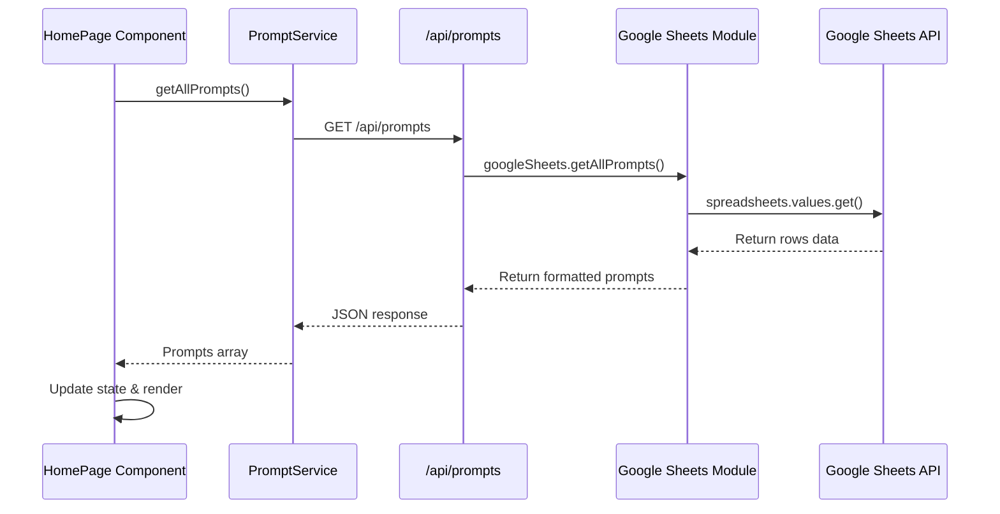
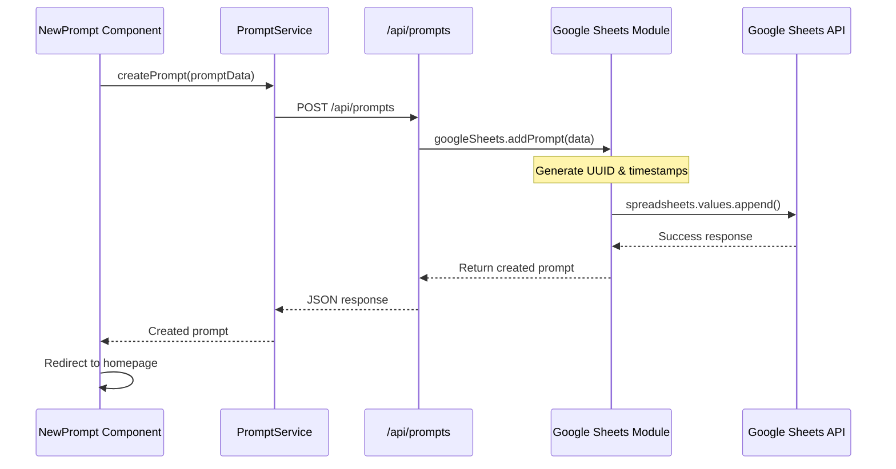
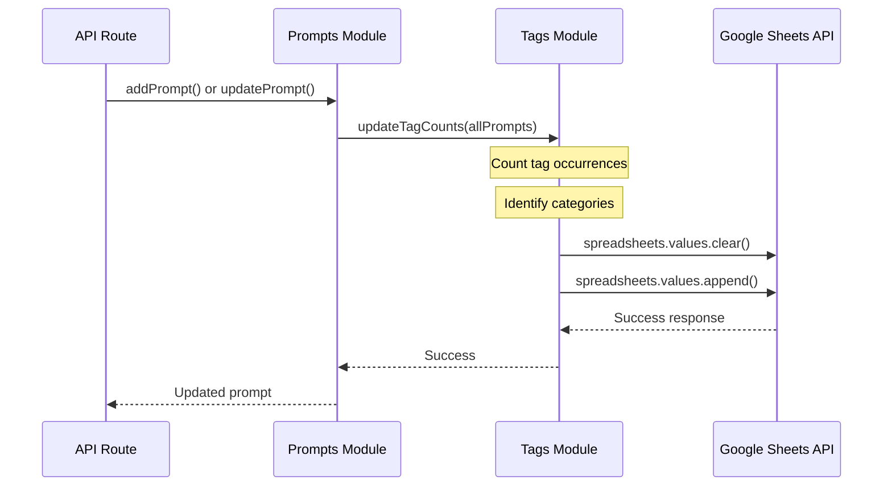

# Prompt Garden - Data Flow Documentation

This document explains how data flows through the Prompt Garden application, from user interactions in the UI to storage in Google Sheets and back. Understanding this flow is essential for developers working on the codebase or adding new features.

## High-Level Data Flow

The overall data flow in Prompt Garden follows this pattern:

1. **User Interface** → User interacts with React components
2. **Service Layer** → Client-side service calls API endpoints
3. **API Routes** → Server-side API handles the request
4. **Google Sheets Integration** → Data is read from or written to Google Sheets
5. **Return Path** → Data flows back through API responses to the UI

## Components of the Data Flow

### 1. User Interface (React Components)

The UI layer consists of React components that:
- Display data to users
- Capture user inputs
- Trigger data operations

Key components include:
- `HomePage` (app/page.tsx)
- `PromptDetail` (app/prompt/[id]/page.tsx)
- `NewPrompt` (app/prompt/new/page.tsx)

### 2. Service Layer

The service layer abstracts API calls for the UI components:
- `PromptService` (lib/api/promptService.ts)

This layer:
- Formats requests
- Handles API errors
- Transforms data between UI and API formats

### 3. API Routes

API routes handle server-side logic:
- `/api/prompts` - List and create prompts
- `/api/prompts/[id]` - Get, update, or delete a specific prompt
- `/api/tags` - Get tag information
- `/api/categories` - Get category information

### 4. Google Sheets Integration

The Google Sheets integration modules:
- Authenticate with Google APIs
- Read and write data to specific sheets
- Transform between API data structures and spreadsheet rows

Key modules:
- `auth.ts` - Authentication with Google
- `prompts.ts` - Prompt CRUD operations
- `tags.ts` - Tag operations
- `setup.ts` - Database initialization

## Example Data Flows

### Fetching All Prompts

When a user visits the homepage, the following data flow occurs:

1. **UI**: HomePage component mounts and calls `loadPrompts()` 
2. **Service**: `PromptService.getAllPrompts()` is called
3. **API**: GET request to `/api/prompts`
4. **Server**: API route handler processes the request
5. **Google Sheets**: `getAllPrompts()` function fetches data from the Prompts sheet
6. **Return**: Data flows back through the same path to populate the UI



### Creating a New Prompt

When a user creates a new prompt:

1. **UI**: User fills form in NewPrompt component and submits
2. **Service**: `PromptService.createPrompt(promptData)` is called
3. **API**: POST request to `/api/prompts` with prompt data
4. **Server**: API route handler validates the data
5. **Google Sheets**: `addPrompt()` function:
   - Generates a new UUID
   - Creates timestamps
   - Formats data for the spreadsheet
   - Appends a new row
6. **Return**: The newly created prompt flows back to the UI, which redirects to the homepage



### Updating Tag Counts

When prompts are created or updated, tag counts need to be synchronized:

1. **Server**: After prompt operations, `updateTagCounts()` is called
2. **Google Sheets Integration**: 
   - Processes all prompts to count tag occurrences
   - Identifies which tags are also categories
   - Clears the existing Tags sheet data
   - Writes updated tag counts
3. **Return**: Updated tag information is available for future requests



## Key Data Transformations

### Prompt Object Structure

The Prompt object structure is consistent throughout the application:

```typescript
interface Prompt {
  id: string;           // UUID for the prompt
  title: string;        // Display title
  content: string;      // The actual prompt text
  tags: string[];       // Array of tag strings
  category?: string;    // Optional primary category
  createdAt: string;    // ISO timestamp
  updatedAt: string;    // ISO timestamp
}
```

### Spreadsheet Row Format

In Google Sheets, each prompt is stored as a row with these columns:

| id | title | content | tags | category | createdAt | updatedAt |
|----|-------|---------|------|----------|-----------|-----------|
| UUID | Title text | Prompt content | Comma-separated tags | Category name | Timestamp | Timestamp |

The transformation between these formats happens in the Google Sheets integration modules:

```typescript
// Converting from spreadsheet row to Prompt object
const promptFromRow = (row) => {
  const [id, title, content, tagsString, category, createdAt, updatedAt] = row;
  const tags = tagsString ? tagsString.split(',').map(tag => tag.trim()) : [];
  
  return {
    id,
    title,
    content,
    tags,
    category: category || undefined,
    createdAt,
    updatedAt
  };
};

// Converting from Prompt object to spreadsheet row
const rowFromPrompt = (prompt) => {
  const tagsString = prompt.tags.join(', ');
  
  return [
    prompt.id,
    prompt.title,
    prompt.content,
    tagsString,
    prompt.category || '',
    prompt.createdAt,
    prompt.updatedAt
  ];
};
```

## Error Handling and Data Integrity

### Error Handling Flow

When errors occur in the data flow:

1. **Google Sheets Integration**: Catches errors, logs details, and rethrows
2. **API Routes**: Catches errors and returns appropriate HTTP status codes
3. **Service Layer**: Handles API error responses and presents user-friendly messages
4. **UI**: Displays error messages and provides recovery options

### Data Validation

Validation happens at multiple levels:

1. **UI**: Form validation for required fields and format constraints
2. **Service Layer**: Data transformation and format validation
3. **API Routes**: Schema validation and business rule checking
4. **Google Sheets Integration**: Data cleanup and fallback defaults

## Optimizing the Data Flow

### Caching Strategies

The application could benefit from caching:

1. **Client-side caching**: Store recently fetched prompts in state
2. **Service Worker caching**: Cache API responses for offline use
3. **Server-side caching**: Cache Google Sheets responses

### Batch Operations

For performance optimization:

1. **Bulk updates**: Group related updates to minimize API calls
2. **Transaction-like patterns**: Ensure data consistency across related operations

## Adding New Data Flows

To add a new data flow (e.g., for a new feature):

1. **UI Component**: Create or update React components that use the data
2. **Service Method**: Add methods to the service layer for the new operation
3. **API Route**: Create an API endpoint to handle the server-side logic
4. **Google Sheets Integration**: Add functions to read or write the data

For example, to add a "favorite prompts" feature:

1. Add UI elements for marking prompts as favorites
2. Add `markAsFavorite(id)` and `getFavorites()` to the service layer
3. Create `/api/favorites` routes for managing favorites
4. Add Google Sheets integration for storing favorite status

## Conclusion

The data flow in Prompt Garden follows a clean layered architecture that separates concerns:

- UI components focus on presentation and user interaction
- The service layer abstracts API communication
- API routes handle server-side logic
- Google Sheets integration manages data persistence

This separation makes the codebase more maintainable and extensible, allowing new features to be added without disrupting existing functionality. 