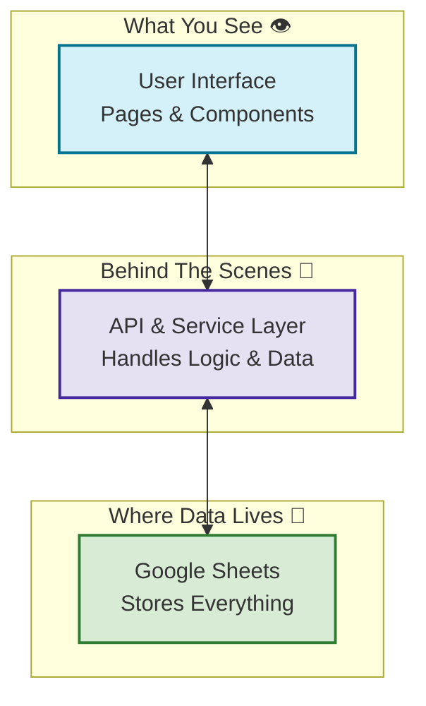

# 🏗️ Prompt Garden - Codebase Architecture

This guide explains how the different parts of Prompt Garden fit together, showing you the overall structure and how information flows through the system.

## Architecture Overview

Prompt Garden is built with Next.js using the App Router pattern. It follows a client-server approach where:

1. **Client-side components** create what you see and interact with
2. **API routes** provide ways for the frontend to talk to the server
3. **Google Sheets** serves as the database where all the information is stored

The application uses modern React features like hooks and context, along with client-side rendering for interactive elements. Data is stored in and retrieved from Google Sheets through API routes that simplify database operations.

## 🔍 Architecture Diagrams

### Detailed Technical Architecture

The following diagram shows the complete technical architecture with all components and their relationships:

### Simplified 3-Layer Architecture

If you're new to web applications, here's a simpler way to understand how Prompt Garden works:

### User-Centric Flow

This diagram shows how the application responds when you use it:

```mermaid
flowchart LR
    User((You)) -->|1. Interact with| Browser[Web Browser]
    Browser -->|2. Display| UI[User Interface]
    UI -->|3. Request data| API[API Layer]
    API -->|4. Fetch or store| Sheets[Google Sheets]
    Sheets -->|5. Return data| API
    API -->|6. Send results| UI
    UI -->|7. Show updates| Browser
    Browser -->|8. You see results| User
    
    classDef user fill:#f9d4e8,stroke:#8f056a,stroke-width:2px;
    classDef browser fill:#d4f1f9,stroke:#05728f,stroke-width:2px;
    classDef appLayer fill:#e5e1f3,stroke:#4527a0,stroke-width:2px;
    classDef dataLayer fill:#d8ebd5,stroke:#2e7d32,stroke-width:2px;
    
    class User user;
    class Browser browser;
    class UI,API appLayer;
    class Sheets dataLayer;
```

### Data Flow for Common Actions

This diagram shows how data moves when you perform common actions:

```mermaid
flowchart TD
    subgraph "View Prompts"
        VP1[Load homepage] -->|Request prompts| VP2[API gets prompts]
        VP2 -->|Fetch from Sheets| VP3[Return prompt list]
        VP3 -->|Display on screen| VP4[You see prompts]
    end
    
    subgraph "Create New Prompt"
        NP1[Fill out form] -->|Submit| NP2[API processes data]
        NP2 -->|Save to Sheets| NP3[Add to database]
        NP3 -->|Confirm success| NP4[Show success message]
    end
    
    subgraph "Filter Prompts"
        FP1[Select filter] -->|Apply filter| FP2[Filter processed]
        FP2 -->|Update display| FP3[Show filtered results]
    end
    
    classDef action fill:#f0e68c,stroke:#8B8000,stroke-width:2px;
    
    class VP1,VP2,VP3,VP4,NP1,NP2,NP3,NP4,FP1,FP2,FP3 action;
```

```mermaid
flowchart TB
    subgraph "Client-Side Components"
        HomePage["Home Page (app/page.tsx)"]
        PromptDetail["Prompt Detail (app/prompt/[id]/page.tsx)"]
        NewPrompt["New Prompt (app/prompt/new/page.tsx)"]
        Header["Header (components/header.tsx)"]
        Footer["Footer (components/footer.tsx)"]
        MainLayout["Main Layout (components/main-layout.tsx)"]
        Sidebar["Sidebar (components/sidebar.tsx)"]
        CodeMirror["CodeMirror Editor"]
        UIComponents["UI Components (buttons, cards, etc.)"]
    end

    subgraph "API Routes"
        PromptsAPI["Prompts API (app/api/prompts/route.ts)"]
        PromptByIdAPI["Prompt By ID API (app/api/prompts/[id]/route.ts)"]
        TagsAPI["Tags API (app/api/tags/route.ts)"]
        CategoriesAPI["Categories API (app/api/categories/route.ts)"]
        SetupAPI["Setup API (app/api/setup/route.ts)"]
        FixDataAPI["Fix Data API (app/api/fix-data/route.ts)"]
    end

    subgraph "Service Layer"
        PromptService["Prompt Service (lib/api/promptService.ts)"]
    end

    subgraph "Google Sheets Integration"
        GoogleSheetsAuth["Authentication (lib/googleSheets/auth.ts)"]
        GoogleSheetsConfig["Configuration (lib/googleSheets/config.ts)"]
        GoogleSheetsPrompts["Prompts Module (lib/googleSheets/prompts.ts)"]
        GoogleSheetsTags["Tags Module (lib/googleSheets/tags.ts)"]
        GoogleSheetsSetup["Setup Module (lib/googleSheets/setup.ts)"]
    end

    subgraph "External Services"
        GoogleSheetsAPI["Google Sheets API"]
    end

    %% Client component relationships
    HomePage --> Header
    HomePage --> Footer
    HomePage --> MainLayout
    HomePage --> Sidebar
    HomePage --> UIComponents
    PromptDetail --> Header
    PromptDetail --> Footer
    PromptDetail --> UIComponents
    NewPrompt --> Header
    NewPrompt --> Footer
    NewPrompt --> CodeMirror
    NewPrompt --> UIComponents

    %% Client to Service Layer
    HomePage -- "fetch prompts" --> PromptService
    PromptDetail -- "fetch prompt by id" --> PromptService
    NewPrompt -- "create prompt" --> PromptService

    %% Service Layer to API
    PromptService -- "GET /api/prompts" --> PromptsAPI
    PromptService -- "GET /api/prompts/[id]" --> PromptByIdAPI
    PromptService -- "POST /api/prompts" --> PromptsAPI
    PromptService -- "PUT /api/prompts/[id]" --> PromptByIdAPI
    PromptService -- "DELETE /api/prompts/[id]" --> PromptByIdAPI
    PromptService -- "GET /api/tags" --> TagsAPI
    PromptService -- "GET /api/categories" --> CategoriesAPI

    %% API to Google Sheets Integration
    PromptsAPI --> GoogleSheetsPrompts
    PromptByIdAPI --> GoogleSheetsPrompts
    TagsAPI --> GoogleSheetsTags
    CategoriesAPI --> GoogleSheetsTags
    SetupAPI --> GoogleSheetsSetup
    FixDataAPI --> GoogleSheetsPrompts

    %% Google Sheets Integration relationships
    GoogleSheetsPrompts --> GoogleSheetsAuth
    GoogleSheetsTags --> GoogleSheetsAuth
    GoogleSheetsSetup --> GoogleSheetsAuth
    GoogleSheetsPrompts --> GoogleSheetsConfig
    GoogleSheetsTags --> GoogleSheetsConfig
    GoogleSheetsSetup --> GoogleSheetsConfig

    %% Connection to external services
    GoogleSheetsAuth --> GoogleSheetsAPI

    %% Style definitions for better visualization
    classDef clientSide fill:#d4f1f9,stroke:#05728f,stroke-width:2px;
    classDef apiRoutes fill:#faebdd,stroke:#8c4606,stroke-width:2px;
    classDef serviceLayer fill:#e5e1f3,stroke:#4527a0,stroke-width:2px;
    classDef googleSheets fill:#d8ebd5,stroke:#2e7d32,stroke-width:2px;
    classDef external fill:#f5f5f5,stroke:#616161,stroke-width:2px;

    class HomePage,PromptDetail,NewPrompt,Header,Footer,MainLayout,Sidebar,CodeMirror,UIComponents clientSide;
    class PromptsAPI,PromptByIdAPI,TagsAPI,CategoriesAPI,SetupAPI,FixDataAPI apiRoutes;
    class PromptService serviceLayer;
    class GoogleSheetsAuth,GoogleSheetsConfig,GoogleSheetsPrompts,GoogleSheetsTags,GoogleSheetsSetup googleSheets;
    class GoogleSheetsAPI external;
```

## 📦 Key Components and What They Do

### Client-Side Components

- **Home Page (app/page.tsx)**: The main landing page showing all prompts with filtering options
- **Prompt Detail (app/prompt/[id]/page.tsx)**: Detailed view of a single prompt
- **New Prompt (app/prompt/new/page.tsx)**: Form for creating a new prompt
- **CodeMirror Editor**: Rich text editor with custom syntax highlighting for prompts

### API Routes

- **Prompts API**: Handles getting all prompts and creating new ones
- **Prompt By ID API**: Manages operations on individual prompts (get, update, delete)
- **Tags API**: Provides tag information for filtering
- **Categories API**: Supplies category information for primary classifications
- **Setup API**: Sets up the Google Sheets database initially
- **Fix Data API**: Helps fix data alignment issues when needed

### Google Sheets Integration

- **Authentication**: Connects securely to the Google API
- **Prompts Module**: Handles creating, reading, updating, and deleting prompts
- **Tags Module**: Manages tags and keeps track of their counts
- **Setup Module**: Helps with initial database setup and structure

## 🔄 How Information Flows

1. **User Actions**: When you interact with the app (clicking buttons, filling forms)
2. **Service Layer**: The PromptService coordinates between what you see and the API
3. **API Routes**: Server-side code processes your requests
4. **Google Sheets Integration**: Data is saved to or retrieved from Google Sheets
5. **Google Sheets API**: The external service where all data is actually stored

This architecture keeps things organized by separating:
- UI components that handle what you see and interact with
- API routes that process data and validate information
- Google Sheets modules that store and retrieve information
- A service layer that connects the user interface to the server

One nice benefit of using Google Sheets as a database is that non-technical users can directly view and edit the data using the familiar Google Sheets interface if they need to. 